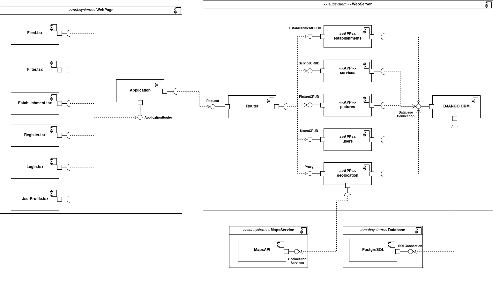

# DAS - Documento de Arquitetura de Software

## 1. Introdução

### 1.1 Finalidade

Este documento tem como finalidade especificar e documentar as decisões arquiteturais do software Encare, usando diferentes visões arquiteturais para detalhar diferentes aspectos do sistema.

### 1.2 Escopo

O escopo desse documento de arquitetura abrange todo a arquitetura do software em diferentes níveis a ser desenvolvido na disciplina. 

### 1.3 Definições, Acrônimos e Abreviações

|Sigla|Descrição|
|---|---|
|DAS|Documento de Arquitetura de Software| 
|MTV|Model Template View|

### 1.4 Visão Geral

O projeto trata de uma aplicação web que tem como objetivo facilitar a procura por serviços de cuidados pessoais. Para isso o projeto contará com uma API que utilizará o framework django e um frontend em ReactJS

## 2. Representação Arquitetural

Esse diagrama mostra de uma forma mais ampla como o software irá trabalhar, mostrando como se relacionam o backend, fronted, usuário, banco de dados e API externa. com isso podemos ter uma visão ampla sobre dodo o processo que envolve todas essas camadas de software.  

Nesse diagrama temos os seguintes participantes:
- **Usuário**: Responsável pelas ações que o sistema terá que lidar. Aqui nesse classe estão também os Administradores do site que irão gerenciar o site, mas também são usuário do site. 
- **Frontend ReactJS**: É a primeira camada do software em relação ao usuário e é a única parte do sistema que client-side. Tem como principal função realizar a comunicação do sistema com o usuário por meio de páginas renderizadas e as interações e a partir disso realizar as requisições necessárias. 
- **Backend Django Python**: É a primeira camada server-side e tem como função tratar as requisições, processar os dados, consultar os dados, consultar APIs externas e prover a modelagem em classes dos dados. É aqui onde ocorre a modelagem de dados.
- **API externa de Mapas**: É uma API onde possa calcular as distâcias entre duas localizações para ser usada nos filtros de distância.
- **Banco de Dados PostgreSQL**: Tem como função de armazenar e persistir os dados da aplicação. 

A seguir iremos explicar brevemente sobre cada uma das tecnologias escolhidas:

### 2.1. Python Django:

[Django](https://www.djangoproject.com/start/overview/) é um framework Python de alto nível que encorja o desenvolvimento rápido e um design límpo e pragmático. foi construido por desenvolvedores experientes e cuida de boa parte do trabalho para que o desenvolverdor possa cuidar do mais importante. Tem como principais caracteristicas:
- Desenvolvido para ser rápido como for possível.
- Inclui dezenas de extras que ajudam a resolver várias tarefas de desenvolvimento Web, como autenticação, RSS feed, entre outros...
- Cuida da segurança de muito processos, como autenticação e acesso ao banco de dados.
- É escalável para possíveis grandes demandas de requisições.
- Muito versátipo

### 2.2. ReactJS:

Para o frontend, a equipe decidiu pela utilização do [ReactJS](https://pt-br.reactjs.org/), uma biblioteca JavaScript bastante popular e voltada a desenvolvimento web. As suas principais caracteristicas são:
 - Baseado em componentes 
 - Pode ser renderizado no servidor através do servidor.
 - Dados são passsados das classes mães para as classes filhas por meio das props. 
 - Um componente por usar plugins externos. 

### 2.3. PostgreSQL:

[PostegreSQL](https://www.postgresql.org/about/) é uma poderosa ferramenta de banco de dados relacional de código aberto que usa e extende as liguagem SQL com algumas funcionalidades que escalam e dimensionam as cargas de dados mais complicadas. 

Essa será a ferramenta usada para persistir os dados da aplicação.

## 3. Metas Arquiteturais e Restrições

### 3.1 Metas:
|Meta|Descrição|
|---|---|
|Portabilidade|O software deverá ser portátil para navegadores mobile e desktop|
|Usabilidade|O usuário deverá ser capaz de realizar as tarefas no menor tempo possível|

### 3.2 Restrições:

|Restrição|Descrição|
|---|---|
|Conectividade|A aplicação precisará de internet para trabalhar|
|Plataforma| A aplicação irá rodar somente em navegadores web|
|Público|A aplicação será voltada ao público brasileiro que seja voltado a cuidados pessoais|
|Língua|A aplicação será voltada a pessoas que falam o português do Brasil|
|Equipe|A equipe possui apenas 7 integrantes|
|Horas semanais de trabalho por integrante|4 horas|
|Deadline|A aplicação deverá ser finalizada até o fim da disciplina|
|Hospedagem|Será usada uma conta básica na Amazon AMS|

## 4. Visão de Casos de Uso

A visão de casos de uso apresenta uma visão próxima do usuário, descrevendo cenários de uso da aplicação.

## 5. Visão Lógica

## 6. Visão de Processos

## 7. Visão de Implantação

## 8. Visão de Implementação

A visão de implementação específica os componentes de código do projeto, como organização dos arquivos, dependências e pacotes em diferentes camadas e subcamadas. Essa visão é representada principalmente pelo diagrama de componentes.

As versões anteriores do diagrama abaixo podem ser visualizadas em [Modelagem](../Modelagem/diagrama_componentes/diagrama_componentes.md).

## 9. Visão de Dados (Opcional)

## 10. Tamanho e Desempenho

## 11. Qualidade

## Referências

[1] Template do [documento de arquitetura de software](https://github.com/UnBArqDsw2020-2/2020.2_G2_Encare/files/6305164/Software.Architecture.Document.pdf). Disponibilizado no moodle da disciplina.
[2] React: Uma biblioteca JavaScript para criar interfaces para usuários. Disponível em: <https://pt-br.reactjs.org/>. Aceso em 19 abr. 2021.
[3] About PostgreSQL. Disponível em: <https://www.postgresql.org/about/>. Acesso em 20 abr. 2021
[4] Django: the web framework for perfectionists with deadlines. Disponível em: <https://www.djangoproject.com/start/overview/>. Acesso em 20 abr. 2021. 

## Versionamento

|Data|Nome|Detalhes|Versão|
|----|---|---|---|
| 16/04/21 | Wagner Martins | Criação do documento | 0.1 |
| 16/04/21 | Wagner Martins | Adição da finalidade | 0.2 |
| 19/04/21 | João Pedro Carvalho | Adição da visão geral e das siglas  | 0.3 |
| 20/04/21 | João Pedro Carvalho | Adição da representação arquitetural  | 0.4 |
| 20/04/21 | João Pedro Carvalho | Adição das metas e restrições arquiteturais  | 0.5 |
| 20/04/21 | Wagner Martins | Adição do diagrama de casos de uso | 0.6 |