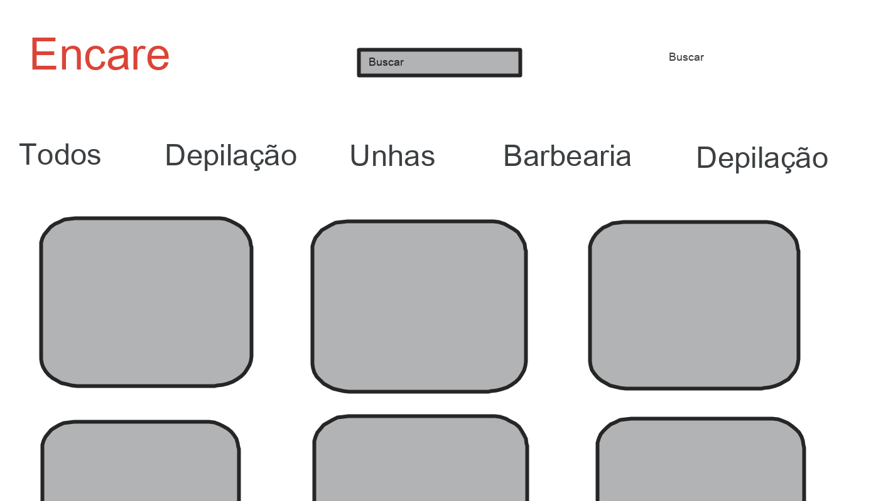
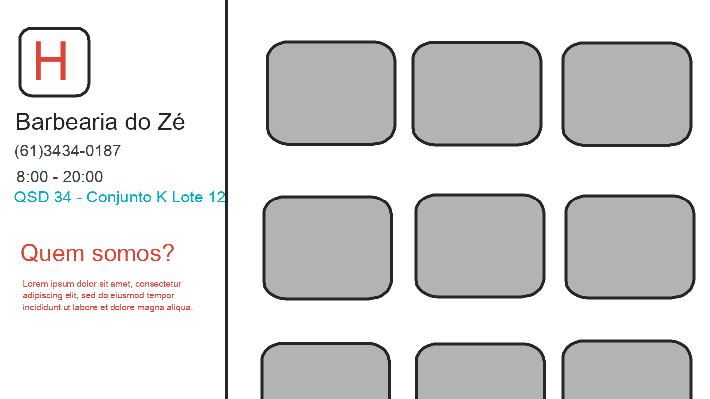
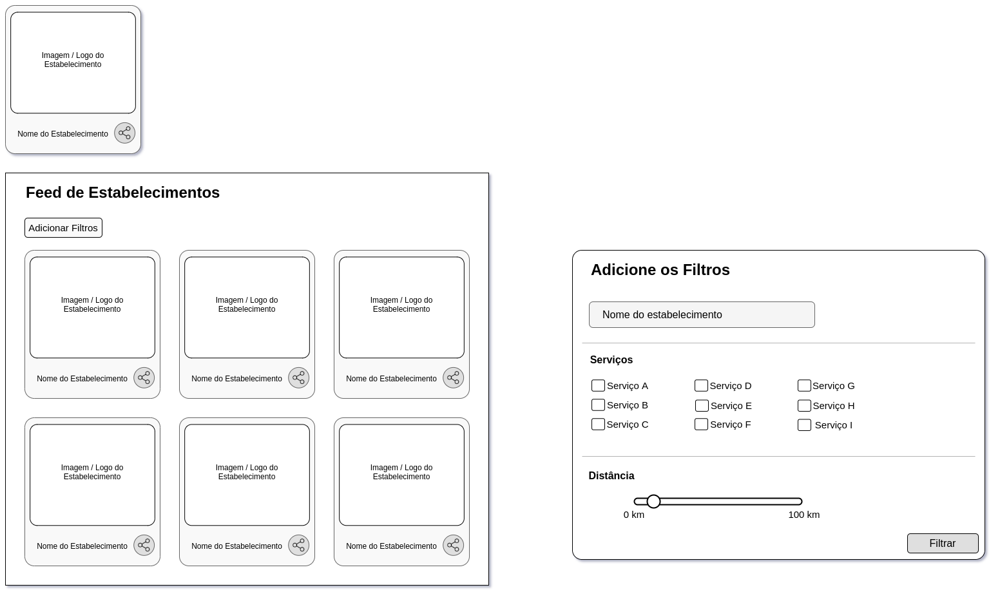
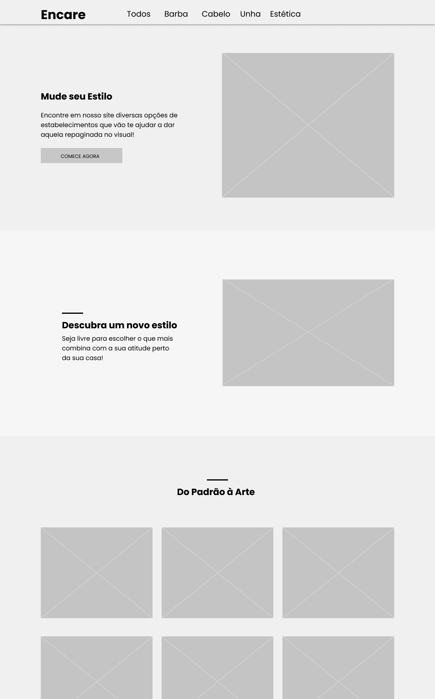
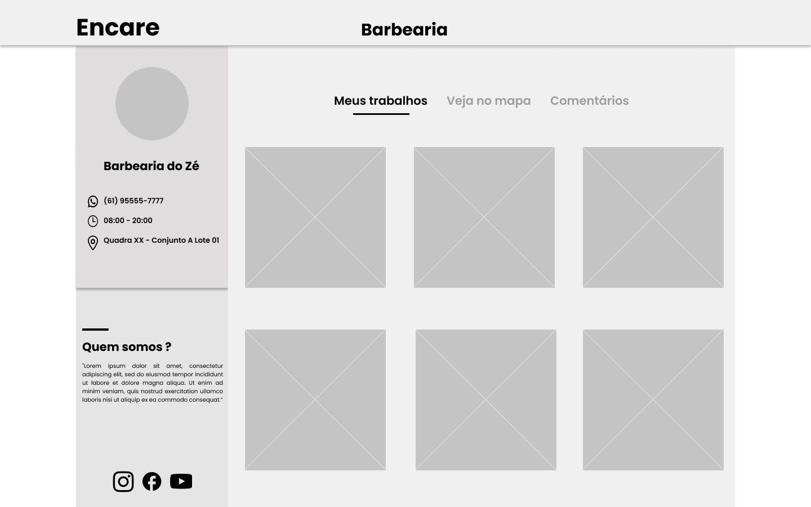
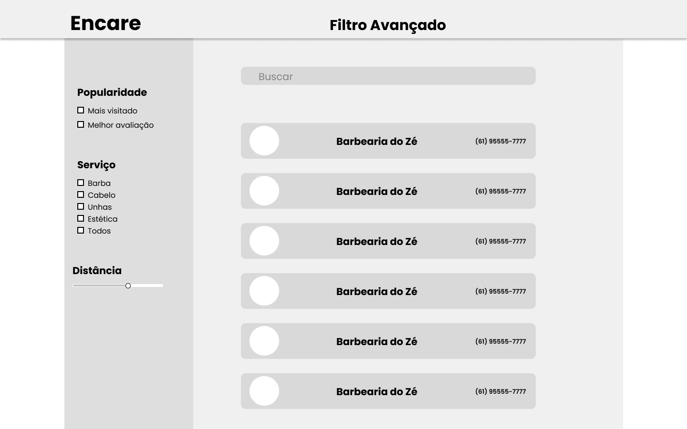

# Protótipos

## Introdução

Uma das técnicas mais usadas para garantir que o produto será bem aceito ou que não causará problemas ao usuário é a prototipação. É um método que ajuda a desenvolver rapidamente uma versão “testável” do seu projeto, seja ele um produto ou serviço.

Para essa prototipação, será utilizado a ferramenta [Figma](https://www.figma.com/).  

Será adotado um modelo evolucionário de prototipação, que consiste em produzir um modelo inicial de protótipo e ir refinando-o ao longo das várias fases do desenvolvimento do projeto até atingir sua forma final.

## Protótipo de Alta Fidelidade

Um protótipo de alta fidelidade (às vezes chamado de high-fi ou hi-fi) é uma representação interativa do produto, baseada no computador ou em dispositivos móveis. Esse protótipo já apresenta maior semelhança com o design final em termos de detalhes e funcionalidade.  

## Protótipo de Média Fidelidade

Um protótipo de média fidelidade visa definir a estrutura de conteúdo da interface, definir o peso, relevância e relação entre os elementos e criar um layout básico (com conteúdos e imagens de marcação).  
Para chegar à primeira versão do protótipo de alta fidelidade, os membros do grupo elaboraram alguns protótipos de média fidelidade para conciliar ideias e construir um protótipo de alta fidelidade mais próximo ao ideal.

## Protótipo 01 
### Autor: Nícalo Ribeiro

  

### Autor: Hugo

  

### Autor: Gustavo

## Protótipo de Alta Fidelidade

### Wireframe

Dessa vez a equipe decidiu produzir os protótipos passo-a-passo, de forma que as ideias tivessem mais espaço para amadurecer e o *front-end* estivesse de acordo com os requisitos evoluidos após a refatoração do escopo. Assim, antes de lançarmos a versão final, decidimos produzir um *Wireframe*.

*Wireframe* pode ser definido como um esqueleto do produto final. Nele está contido o conjunto de estruturas do site e os principais elementos, organizados por formas geométricas que ajudam a visualizar um produto real.

**Home**

Na Home dispusemos os elementos de forma que simplificasse cada sessão de serviço para o usuário, dividindo em quatro os atributos: 

- Menu
- Apresentção
- Mapa
- Feed de serviços

Homepage do site - Hugo

**Perfil do Estabelecimento**

A página de Perfil conta com as principais informações do Estabelecimento, descrição do mesmo (afim de engajar o cliente), e um menu onde o cliente pode visualizar por:

- Trabalhos realizados
- Posição no Mapa
- Comentários de clientes daquele estabelecimento

Página de perfil do Estabelecimento - Hugo

**Filtro de Estabelecimentos**

A página de *Filtro Avançado* foi criada para permitir que o usuário pudesse fazer uma busca personalizada, de forma a economizar tempo buscando por tipo de serviço ou distância, por exemplo.

Página de Filtro Avançado - Hugo
### Versão 1
<iframe style="border: 1px solid rgba(0, 0, 0, 0.1);" width="800" height="450" src="https://www.figma.com/embed?embed_host=share&url=https%3A%2F%2Fwww.figma.com%2Fproto%2FxJ49RxNyO7ulXwd86Gxbov%2FUntitled%3Fnode-id%3D2%253A17%26scaling%3Dscale-down" allowfullscreen></iframe>  

Caso haja problema na visualização, [Clicar aqui](https://www.figma.com/proto/xJ49RxNyO7ulXwd86Gxbov/Untitled?node-id=2%3A17&scaling=min-zoom).

## Referências

- Prototipagem de alta fidelidade: o que é, quando, por que e como usar?. Medium. Disponível em: <http://medium.com/somos-tera/prototipagem-de-alta-fidelidade-635d745b662b>. Acesso em: 18 de março de 2021.

- ALEX, Jefferson. Protótipos de baixa, média e alta fidelidade. Disponível em: <https://jeffersonalex.medium.com/prot%C3%B3tipos-de-baixa-m%C3%A9dia-e-alta-fidelidade-bf04870325a6>. Acesso em: 18 de março de 2021.

- BECKER, Lauro. Wireframes, o que são e por que os utilizamos?. Orgânica Natural Marketing. Disponível em: https://www.organicadigital.com/blog/o-que-sao-wireframes-e-por-que-os-utilizamos/. Acesso em 25/03/2021

## Versionamento 

|Data|Descrição|Autor(es)|Versão|
|----|---------|---------|------|
|18/03/2021| Criação do documento | Nícalo, Gustavo, Hugo | 0.1 |
|18/03/2021| Estruturação do documento | Nícalo, Gustavo, Hugo | 0.2 |
|18/03/2021| Adicao do prototipo de média 01 | Nícalo | 0.3 |
|18/03/2021| Adição da primeira versão do protótipo de alta fidelidade | Nícalo | 0.4 |
|18/03/2021| Adição dos protótipos do Hugo e Do Gustavo | Gustavo, Hugo, Nícalo | 0.5 |
|19/03/2021| Adição de alguns ajustes na página | Gustavo | 0.6 |
|25/03/2021| Adição do Wireframe Home | Hugo | 0.7 |
|25/03/2021| Adição do Wireframe Perfil e Descrição das pages | Hugo | 0.8 |
|08/04/2021| Adição do Wireframe Filtro | 0.9 |