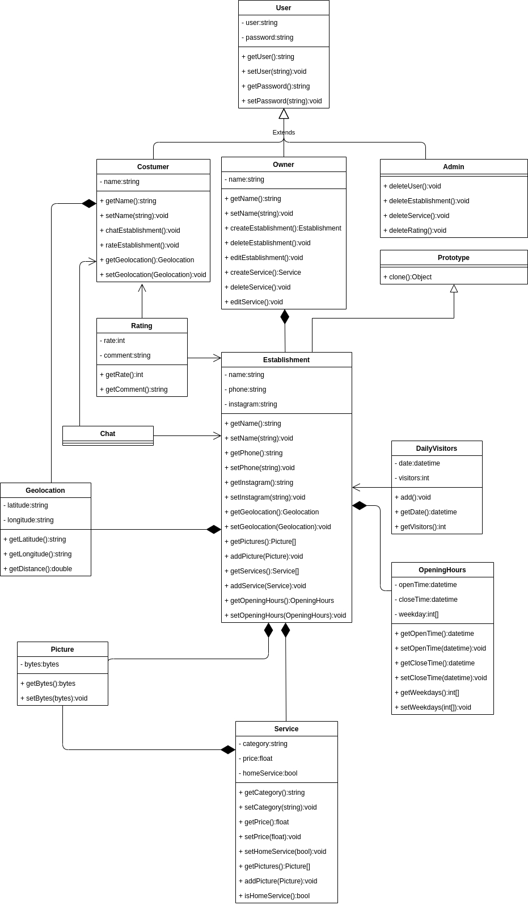
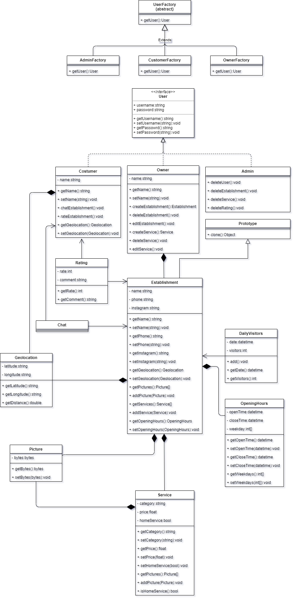

# Padrões de projeto GOFs Criacionais
## 1. Introdução

Os padrões de projeto criacionais abstraem o proceso de instaciação do objeto. Eles ajudam a fazer o sistema independente na maneira em que são criados, compostos e representados. Em outras palavras esse padrões se concentram em oferecer soluções para problemas recorrentes principalmente na criação/instanciação de objetos.

A seguir iremos apresentar os principais padrões criacionais e como eles se aplicam o projeto, explicando também o problema/solução. 

## 2. Factory method

O *factory method* (método de fábrica) consiste no instanciamento de um produto concreto que usa uma interface, por exemplo, uma aplicação que requer um objeto com uma interface específica para realizar as tarefas. 

### 2.1. Vantagens:

* Poder facilmente adicionar mais produtos concretos que utilizam a mesma interface.
* Evitar um alto grau de acoplamento no código.

### 2.2. Desvantagens:

* Caso seu uso seja excessivo pode acarretar a um grande número de subclasses e de arquivos dentro do software.

### 2.3. Aplicação no projeto:

O factory method não se encaixa bem no projeto atual. O maior problema que é resolvido com esse método é quando não se consegue antecipar para a classe qual é o objeto que será instanciado ou quando tem várias classes que implementam uma mesma interface/classe abstrata, coisas que não estão presentes na atual modelagem do projeto. 

## 3. Builder

O padrão de projeto *Builder* tem como objetivo separar a construção de objetos complexos da sua representação de modo que o mesmo processo de construção pode criar várias representações.

Seu funcionamento começa na classe *Director* que possui o método que chama o *ConcrectBuilder* específico, de acordo com os parâmetros especificados. Essa classe não é essencial nesse padrão, mas é importante. Outra parte desse processo são as classes *Builders*; a primeira é uma classe abstrata que declara os métodos que devem ser implementados por um *ConcrectBuilder*; esta classe é uma classe concreta que implementa os métodos necessários para a construção do produto e, por fim, a classe *Product* é o resutado da construção implementada no *ConcrectBuilder*. Tendo em vista esse processo, ess padrão de projeto é vantajoso somente se o processo de contrução do produto em sí é muito complexo, sendo necessário a separação de responsabilidades entre as classes.

### 3.1. Vantagens:

* Pode-se usar a mesma construção para diversas representações do produto. Em outras palavras favorece a reusabilidade do código.
* Pelo princípio da única responsabilidade, é separado a responsabilidade de construir o objeto de quem o usa.
* É possível criar uma construção de um objeto em etapas.
* Entrega um maior controle sobre a construção de um objeto.

### 3.2. Desvantagens:

* Aumenta a complexidade do código, ja que esse padrão requer a criação de múltiplas classes.
* Requer que a classe Builder seja mutável.

### 3.3. Aplicação no projeto: 

Todas as classes do projeto não têm mais de 4 atributos que necessitam ser inicializados junto ao objeto, oque torna a criação da maioria das classes simples ao ponto de o padrão de projeto builder se tornar desisteressante. Há apenas uma classe que pode ser usada para aplicar o método Builder que é a *OpeningHours*, ja que os horários de abertura e fechamento estão em um formato específico e cada dia da semana tem um próprio funcionamento; atualmente a responsabilidade para contrução desse objeto é da própria classe *Opening Hours*.

## 4. Singleton

Garante que uma classe tenha apenas uma instância em todo o código e oferece um ponto de acesso global para essa classe. Em outras palavras, esse padrão é usada para quando precisa de uma classe de acesso global no código, garantindo apenas uma instância. 

Para isso é necessário a implementação de uma classe que irá ser a variável global e em caso de multithreading irá controlar também o acesso, sob risco de criar novas instâncias. 

### 4.1. Vantagens:

- Controla o acesso a essa instância.
- Facilidade em permitir um maior número de instâncias (Multiton);
- Substitui variáveis globais.

### 4.2. Desvantagens:

- É mais difícil de testar, visto que várias partes do código alteram essa classe.
- Viola o princípio de responsabilidade única
- Requer tratamento especial em caso de concorrência.
- Em [5] O próprio autor fala que esse é o único padrão de projeto que ele retiraria em uma refatoração do livro.

### 4.3. Aplicação no projeto:

Dentro da nossa modelagem, a principal classe que pode ser usada o padrão *singleton* é são as classes que geram autenticação: *Costumer*, *Owner* e *Admin*. Como elas podem ser acessadas de várias parte do código, então são as favoritas para serem aplicadas os padrões de projeto.

## 5. Multiton

Esse padrão é apenas uma generalização do *Singleton* sendo que este autoriza apenas uma instância, enquanto o *Multiton* permite uma quantidade controlada de instâncias.

### 5.1. Vantagens:

- Controla o acesso a várias instâncias.
- Substitui variáveis globais.

### 5.2. Desvantagens: 

- É mais difícil de testar, visto que várias partes do código alteram essa classe.
- Viola o princípio de responsabilidade única
- Requer tratamento especial em caso de concorrência.

### 5.3. Aplicação no projeto:

Assim como o *singleton* o escopo atual não permite o uso desse padrão de forma se tornar vantajoso ao sistema. Por outro lado, assim como o *singleton*, na ferramenta usada no ReactJS, que é o framework que será usado no frontend, há a aparição do padrão de projeto *singleton*/*multiton* no uso do *Context API*. 

## 6. Object poll:

Esse padrão permite uma boa economia de performace e sendo usado principalmente em casos em que o custo do instaciamento de uma classe é bem pesado. Seu fucionamento se baseia no armazenamento de classes que não estão sendo usadas e não destruindo-as podem ser usadas posteriormente. Um exemplo clássico de seu uso são de classes que precisam ser renderizadas em games; ao invés de destruir, a classe é armazenada para ser usada posteriormente, assim, o programa não precisa renderizar tudo novamente.

### 6.1. Vantagens:

- Alta economia de desempenho.

### 6.2. Desvantagens:

- Uso de memória alto a depender da situação.

### 6.3. Aplicação no projeto:

O Object pool se mostra vantajoso quando quando existem classes que demandam tempo e processamento para serem instanciadas. Essa condição não se aplica ao projeto, visto que a implementação das atuais classes não são pesadas em questão de performance.

## 7. Abstract factory

É um padrão que é usado no instanciamento de familias de objetos que possuem categorias em comum. É criada uma classe abstrata factory e para cada categoria é criada uma classe concreta implementando a factory abstrata. Cada classe concreta dessas é responsável pelo instanciamento de classes de uma mesma categoria, mas de famílias diferentes.

#### 7.1. Vantagens:

- Aplicação do princípio Open/Closed Principle.
- Aplicação do princípio da responsabilidade única.
- Os produtos sao compatíveis entre si.

#### 7.2. Desvantagens:

- Adiciona bastante complexidade ao código.

#### 7.3. Aplicação no projeto:

A modelagem do nosso projeto não possui o principal ponto do *abstract factory* que é famílias de classes que podem ter categorias em comum. Como veremos a seguir, a nossa modelagem possui apenas uma família de classes, o que inviabiliza o uso da *abstract factory*.

## 8. Prototype

Esse padrão cria um novo objeto a partir de uma cópia de um objeto já existente. Isso evita muito processamento de instaciamento de classes, em caso de classes complexas. 

#### 8.1. Vantagens: 

- Oculta as classes concretas do código cliente.
- Ajuda na criação de objetos caros/complexos
- Evita a explosão de subclasses.

#### 8.2. Desvantagens: 

- Clonar objetos que tem referências a outros objetos pode ser complexo.

#### 8.3. Aplicação no projeto:

Esse padrão será aplicado no projeto na classe *Establishment*, pois é uma das classes mais complexas do projeto e esse padrão pode ajudar quando o usuário quer criar um novo estabelecimento a partir de um já existente, aproveitando a maior parte das informações. Pensando nisso é melhor usar um objeto existente e fazer uma cópia do que instanciar e inicializar do zero.

## 9. Conclusão:

Aqui está a versão final da modelagem do projeto:

### Versão 1.0:

### Versão 2.0:

## 10. Referências:

[1] - Design patterns: Elements of reusable object-oriented software
[2] - https://www.geeksforgeeks.org/factory-method-python-design-patterns/ acesso em 31/03/2021 as 15:22
[3] - https://www.geeksforgeeks.org/builder-method-python-design-patterns/ acesso em 31/03/2021 as 19:00
[4] - https://www.geeksforgeeks.org/singleton-design-pattern/ acesso em 31/03/2021 as 21:00
[5] - https://www.informit.com/articles/article.aspx?p=1404056 acesso em 31/03/2021 as 21:15
[6] - https://en.wikipedia.org/wiki/Multiton_pattern acesso em 01/04/2021 as 17:20
[7] - https://sourcemaking.com/design_patterns/object_pool acesso em 01/04/2021 as 17:38
[8] - https://en.wikipedia.org/wiki/Object_pool_pattern acesso em 01/04/2021 as 17:50

## 11. Versionamento:

|Data|Nome|Detalhes|Versão|
|----|---|---|---|
| 31/03/2021 | João Pedro Carvalho | Adicionando factory methodo e iniciando o documento | 0.1 |
| 31/03/2021 | João Pedro Carvalho | Adicionando builder  | 0.2 |
| 31/03/2021 | João Pedro Carvalho | Adicionando singleton  | 0.3 |
| 01/04/2021 | João Pedro Carvalho | Adicionando multiton e object pool  | 0.4 |
| 01/04/2021 | João Pedro Carvalho | Adicionando abstract factory e prototype  | 0.5 |
| 02/04/2021 | João Luis Baraky | Corrige erros de ortografia | 0.6 |
| 02/04/2021 | João Luis Baraky | Adiciona Factory Method à modelagem (v2) | 0.7 |
