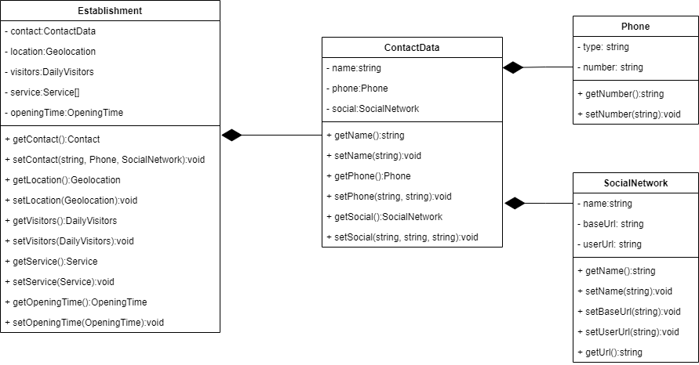
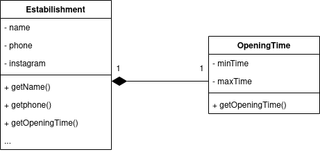
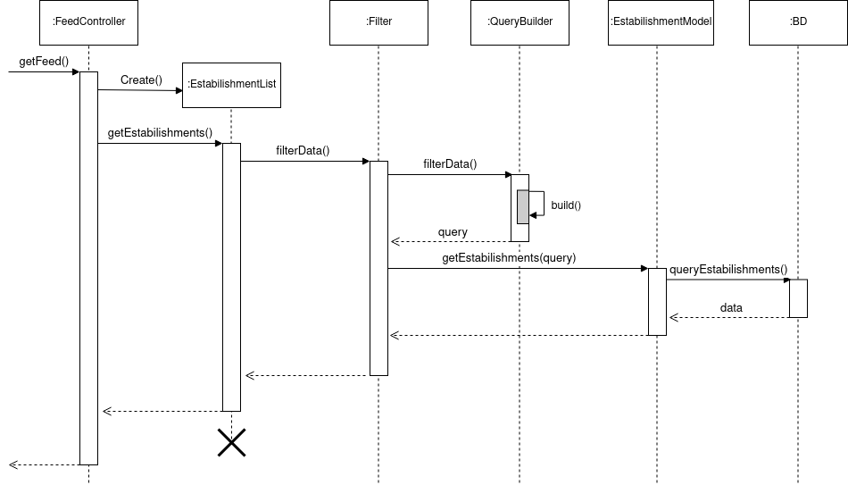
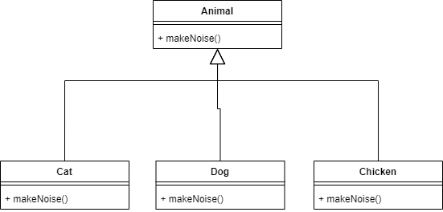
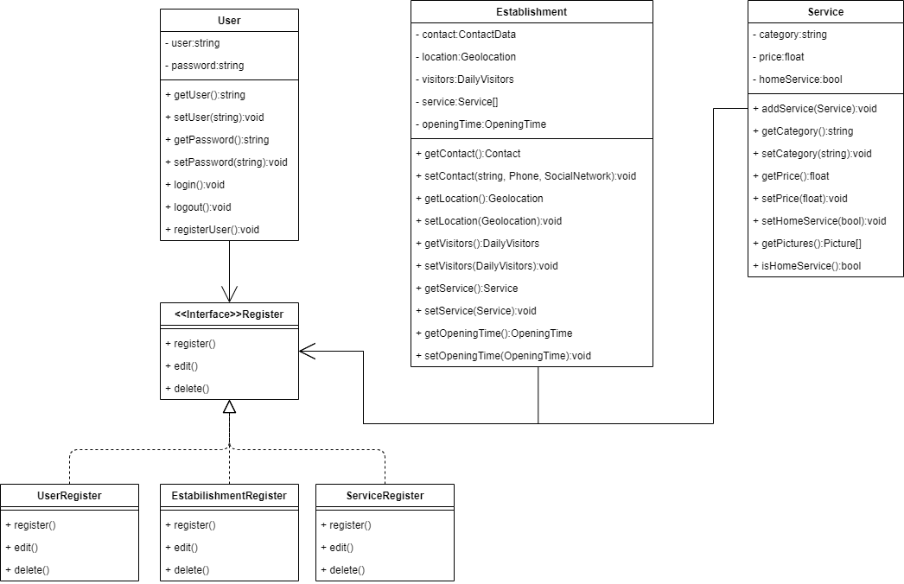

# GRASPs

Os padrões GRASP fornecem uma abordagem
sistemática para a atribuição de responsabilidades às
classes do projeto e englobam uma série de princípios baseados na Orientação a Objetos. Seu termo vem do inglês e significa <i>General Responsibility Assignment Software Patterns</i>.  
Dentre os tipos de GRASPs, temos :  
- Criador;
- Especialista;
- Alta Coesão;
- Baixo Acoplamento;
- Controladora;
- Polimorfismo;
- Invenção pura;
- Variações protegidas.

## Criador

Este princípio determina qual classe deve ser responsável pela criação certos objetos ou instâncias.

Para definir criadores, é importantes responder à problemática de quem deve ser responsável por criar uma nova instância de uma determinada classe. Para responder isso, existem algumas indagações a serem levandas em consideração, assim, deve-se atribir a uma classe B a responsabilidade de criar uma instância de A se
pelo menos uma dessas condições é verdadeira :
- B contém ou agrega A;
- B registra a existência de A;
- B usa A;
- B tem os dados necessários para a inicialização de A que
serão passados ao construtor de A.

Caso nenhuma dessas condições seja atendida, a própria classe é responsável por "se criar" ou por criar uma nova instância dela mesma.

### Aplicação no projeto

A versão 1 do diagrama de classes, mais especificamente a classe Estabilishment apresenta um baixo nível de coesão, com muitas responsabilidades de forma não especializada. Segue abaixo uma versão reduzida da mesma classe:

#### OpeningTime

Os atributos minTime e maxTime representam respectivamente o horário de abertura e fechamento do estabelecimento. Estes atributos podem ser separados em outra classe, assim como seus respectivos métodos (_getMinTime()_, ou _getMaxTime()_ por exemplo). Um exemplo conceitual dessa separação pode ser visto abaixo:

A palavra **contém** indica um forte relacionamento entre as classes. Uma vez que o horário de funcionamento de um estabelecimento só faz sentido existir se o seu respectivo estabelecimento existe. Essa relação é uma composição, criando as seguintes classes:

Em suma, a classe Estabilishment é a responsável por criar uma instância da classe OpeningTime. Essa separação também aumenta a [coesão](#alta-coesao) da classe.

#### ContactData [escopo aumentado]

No caso da classe *ContactData* os atributos que definem os dados de contato da classe Estabilishment foram separados de modo a dividir suas respectivas responsabilidades. As classes *Phone* e *SocialNetwork* são responsáveis por armazenar as informações de telefone e redes sociais, respectivamente, com o objetivo de intermediar a coleta de dados, e atrinuíndo à classe *ContactData* a responsabilidade de armazenar e tratar os contatos dos estabelecimentos. Ao distribuir essa responsabilidade, a *Estabilishment* fica responsável apenas por armazenar os dados de contato compilados.

## Especialista

Este princípio determina quando devemos delegar a responsabilidade para um outro objeto que seja especialista naquele domínio.  

A problemática envolvida está relacionada à necessidade de um princípio para a  atribuição de responsabilidade a objetos, onde escolhas são necessárias durante um projeto para a atribuição de responsabilidades a classes.  
Como solução, atribui-se uma responsabilidade a uma classe que possui a informação necessária para cumpri-la, devendo-se deixar bem claro qual é essa responsabilidade.

### Aplicação no Projeto

Ainda utilizando o exemplo das classes Estabilishment e OpeningTime (agora com alguns seus métodos):

A responsabilidade de guardar os dados dos horários de abertura e fechamento, assim como de retornar eles está na classe OpeningTime. Essas responsabilidades são a **especialidade** da classe, o que aumenta a coesão do sistema.

**V2 [escopo aumentado]**

No escopo aumentado, a responsabilidade da *OpeningTime* foi dividida com a nova *OpeningDay* de forma que os dias da semana podessem ser tratados de forma independente (considerando que o estabelecimento feche mais cedo em algum dia da semana, ou não abra em outro). Dessa forma cabe à *OpeningTime* apenas compilar e tratar esses dados, onde serão armazenados na *Estabilishment*. 

## Controlador

 Este princípio atribui a responsabilidade por lidar com eventos do sistema a uma classe que não esteja relacionada a interface com o usuário.

 Ele surge da problemática de quem deve ser o responsável por lidar com um evento que ocorre na interface de usuáro (UI).  
 Para resolver isso, deve-se atribuir a responsabilidade de receber ou lidar com um evento do sistema a uma classe que representa todo o sistema, a um sub-sistema e a um cenário de caso de uso.     

 É interessante também seguir alguns princípios para a elaboração desse modelo, como não conectar objetos da UI com objetos não pertecentes da UI e não aplicar métodos lógicos, como algum tipo de cálculo, aos métodos de um objeto da UI, a fim de modularizar o desenvolvimento das camadas de apresentação e negócio e minimmizar, na camada de negócio, as alterações nos requisitos da UI.

### Aplicação no Projeto

Para este exemplo, consideraremos a primeira história de usuário, que diz respeito a visualização do feed de estabelecimentos.

Considerando uma controladora apenas para este caso de uso, a FeedController é responsável por passar a requisição do feed para outros módulos ou classes mais especializadas. 

O exemplo abaixo mostra um diagrama conceitual de quais componentes participariam do processamento da requisição:

Para melhor entendimento da ordem de execução, segue um diagrama de sequência para este caso:

Este é um caso básico onde a classe FeedController apenas processa uma requisição. Entretanto, caso sejam adicionadas mais requisições relacionadas ao feed, esta controladora manteria a responsabilidade de direcionar o processamento à classe correta. 

## Polimorfismo

No Polimorfismo as operações polimóficas devem ser utilizadas sobrepondo o conceito de decisão. Nessa abordagem uma classe principal pode ser utilizada como base, definindo as características básicas do que seus derivados devem ser, ou seja, uma classe *Animal* pode definir um método *emitirSom()* e permitir que as classes derivadas: *Gato*, *Cachorro* e *Galinha* executem o mesmo comportamento e ao mesmo tempo possuam características próprias. Exemplo:

### Aplicação no Projeto

No caso da nossa aplicação, a tarefa de Registrar Entidades foi padronizada, de forma que a *Register* fosse responsável por definir um CRUD principal, onde as classes derivadas pudessem executar o registro de acordo com o tipo de necessidade específica, no caso *UserRegister*, *EstabilishmentRegister* e *ServiceRegister*. Essa aplicação faz com que as classes *User*, *Estabilishment* e *Service* não precisem se preocupar com criar um novo registro, apenas armazenar os mesmos. 

## Alta Coesão

Alta coesão é um padrão avaliativo que tenta manter os objetos adequadamente focados, gerenciáveis e compreensíveis. Um elemento com alta coesão tem suas responsabilidades fortemente relacionadas e altamente focadas. Alternativamente, um elemento com baixa coesão tem muitas responsabilidades distintas, não relacionadas, logo pouco focados. Quanto maior a coesão, maior a facilidade de entender, modificar, reutilizar e manter.

## Baixo Acoplamento

Acoplamento é uma medida de quão forte um elemento está conectado, tem conhecimento ou depende de outros elementos. O baixo acoplamento é um padrão de avaliação que determina como atribuir responsabilidades de suporte, como diminuir dependência entre as classes, diminuir o impacto em outras classes ao fazer modificações e aumentar o potencial de reutilização.

## Indireção

O padrão de indireção suporta baixo acoplamento entre dois elementos, atribuindo a um objeto intermediário a responsabilidade de ser um mediador entre eles. Um componente _controller_ no padrão Model-View-Controller ou MVC, serve de exemplo neste caso, uma vez que a responsabilidade dele é separar a camada de interação com o usuário da camada que cuida da lógica de negócios e dos dados.

<!-- ## Fabricação ou Invenção Pura -->

<!-- ## variações Protegidas -->

## Versionamento

|Autor(es)|Data|Versão|Descrição|
|---------|:--:|:----:|---------|
|Wagner Martins| 24/03/21 | 0.1 | Criação do documento |
|Wagner Martins| 24/03/21 | 0.2 | Adição de exemplos de aplicações no projeto para os GRASPs criador, especialista e controlador|
|Nícalo Ribeiro| 26/03/21 | 0.3 | Adição da definição de alguns conceitos|
|Nícalo Ribeiro| 26/03/21 | 0.4 | Adição da definição de controlador e complementação de especialista|
|Hugo Aragão   | 07/04/21 | 0.5 | Adição da classe ContactData |
|Hugo Aragão   | 07/04/21 | 0.6 | Adição da classe OpeningTime do escopo aumentado |
|Hugo, Wagner, Nícalo| 07/04/21| 0.7 | Adição do conceito Polimorfismo |
|Hugo, Wagner, Nícalo| 08/04/21| 0.8 | Adição dos conceitos de Alta Coesão, Baixo Acoplamento e Indireção|

## Referências

[1] Slides das aulas, disponível no moodle da disciplina.

[2] Site: GRASP (padrão orientado a objetos). Disponível em <https://pt.wikipedia.org/wiki/GRASP_(padr%C3%A3o_orientado_a_objetos)>. Acesso: 05/04/21

[3] Site: RDD – Responsibility Driven Design e GRASP – General Responsibility Assignment Software Principles. Disponível em <http://nelsonbassetto.com/blog/tags/grasp/>